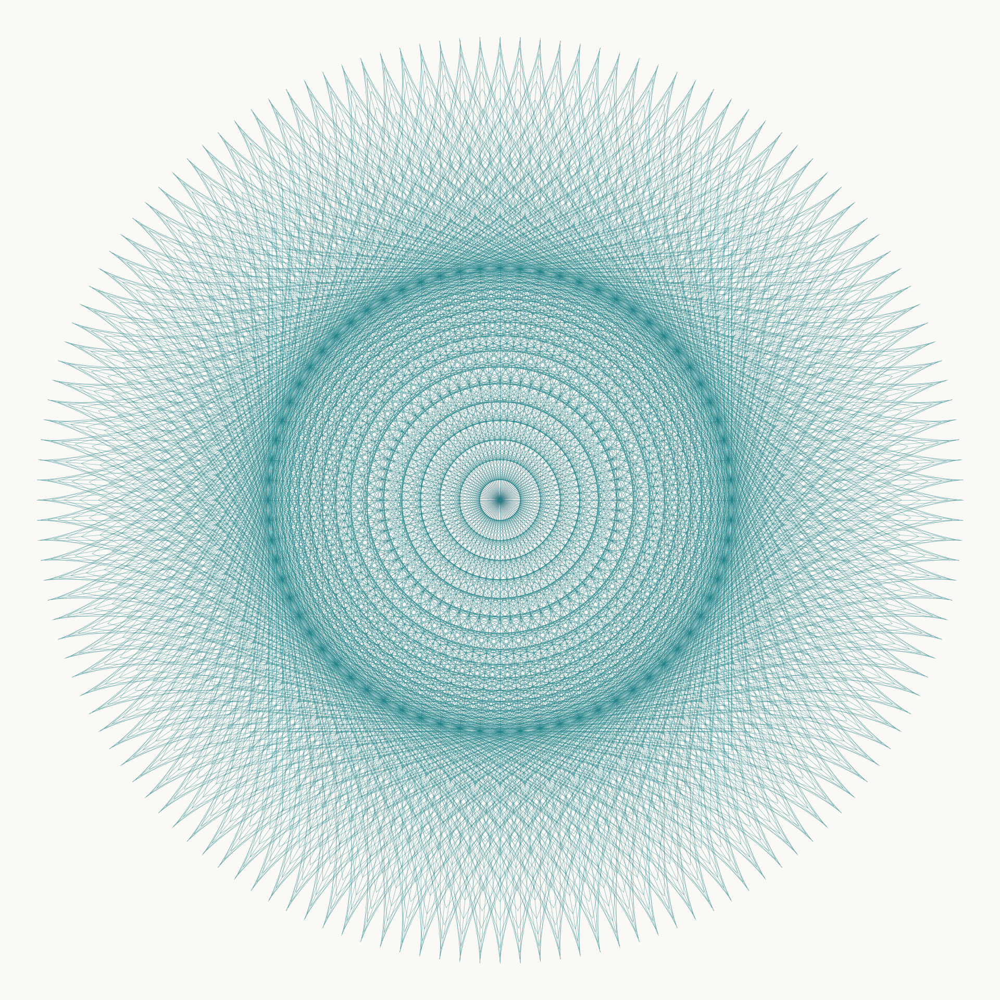

# Adler-Fraktal / Adler Fractal

**Marcus Adler · Spezifikation und Referenzcode v1.0.0 · Stand 30. September 2026**

Dieses Paket dokumentiert die radiale Zeichenvorschrift aus `original/eagle_fractal.py` unter dem von Marcus Adler vorgeschlagenen Namen **Adler-Fraktal**. Es enthält eine formale Definition, einen ausführbaren Generator, mathematische Beweise, Abbildungen und ein englisches Manuskript. Version 1.0.0 wurde für die öffentliche Ablage als technischer Bericht auf Zenodo vorbereitet. Das zugehörige Quellcode-Repository ist [maadler/adler-fractal](https://github.com/maadler/adler-fractal). Der DOI `10.5281/zenodo.23057945` wurde vor Erstellung dieser Dateien tatsächlich reserviert und wird mit der öffentlichen Ablage registriert. Der Bericht ist nicht unabhängig begutachtet; mathematische Neuheit wird nicht behauptet.

Die Literaturprüfung zeigt: Die kontraktive Endpunktmenge gehört zu bekannten regulären Polygon-IFS. Auch die abgeschlossene schrumpfende Linienfigur ist ein Spezialfall bekannter inhomogener selbstähnlicher Mengen. Eine eigenständige neue Fraktalfamilie oder Priorität wird nicht behauptet. Der Name bezeichnet hier die dokumentierte Zeichenvorschrift und ihre Varianten.



## Die wichtigsten Ergebnisse

| Objekt | Ergebnis |
| --- | --- |
| Original, 72 Richtungen, Länge 200, Tiefe 2 | 5.256 Zeichenbefehle; Radius 400 |
| Endpunkte der zweiten Generation | 5.184 Adressen, aber nur 2.593 verschiedene Punkte |
| Rekursionstiefe 3 / 4 | 378.504 / 27.252.360 Zeichenbefehle |
| Jede endliche Linienfigur mit positiver Tiefe | Hausdorff-Dimension 1 |
| Original mit gleich langen Linien, alle Generationen | Endpunkte dicht in der Ebene; Abschluss der Linienmenge ist die ganze Ebene |
| Schrumpfende Endpunkte, `0 < r < 1` | Kompakter Attraktor der Abbildungen `f_j(x) = L u_j + r x` |
| Abschluss aller schrumpfenden Linien | Endpunktattraktor plus abzählbare Vereinigung der gezeichneten Segmente |
| Dimension der abgeschlossenen schrumpfenden Linienfigur | `max(1, dim_H K)`; die Endpunktdimension ist gesondert zu bestimmen |

**Korrektur gegenüber der ersten Chat-Erklärung:** Bei Tiefe 4 sind es 27.252.360, nicht 27.630.360 Zeichenbefehle. Außerdem ist ein Skalierungsfaktor unter 1 allein kein Nachweis einer neuen oder nichtganzzahligen Fraktalstruktur. Beispielsweise ergibt die Endpunktmenge bei vier Richtungen und `r = 0,5` ein ausgefülltes Quadrat.

Die Endlichkeit einer gezeichneten Abbildung ist dagegen **kein Gegenargument**: Auch klassische Fraktale werden endlich dargestellt. Die mathematische Einordnung bezieht sich hier auf die definierte Rekursionsregel und ihre jeweiligen Grenzmengen. Die nachgereichte App-Anzeige mit „Tiefe 4 · 111.150 Striche“ passt, sofern alle Befehle dieser Rekursion gezählt werden, zu `m = 18` und `α = 20°`. Das stimmt mit dem Default-Winkel des Originalfunktionskopfs überein, während dessen Main-Aufruf 5° benutzt. Aus dem Screenshot wird weder eine Skalierungsregel noch eine genaue Übereinstimmung des App-Codes abgeleitet.

## Start ohne zusätzliche Python-Pakete

Python 3.10 oder neuer genügt für die Geometrie, Tests und SVG-Exporte. Die folgenden Befehle werden im entpackten Projektordner ausgeführt:

```bash
python3 -m adler_fractal --output adler_original.svg
python3 -m adler_fractal --angle 5 --iterations 2 --length 200 --scale 1 --stats
python3 -m adler_fractal --spokes 8 --iterations 5 --scale 0.25 --output octagonal_trace.svg
python3 -m adler_fractal --spokes 8 --scale 0.25 --mode chaos --samples 100000 --output octagonal_endpoints.svg
python3 -m unittest discover -s tests -v
```

`trace` zeichnet sämtliche Segmente bis zur angegebenen Tiefe. `endpoints` zeichnet nur Endpunkte der letzten Generation mit Adressmultiplikität. `chaos` liefert eine reproduzierbare Stichprobe der unendlichen kontraktiven Endpunktmenge; die Rekursionstiefe wird in diesem Modus nicht verwendet.

Für PNG-Dateien und die Manuskriptabbildungen mit den festgehaltenen Paketversionen wird Python 3.11 oder neuer benötigt. Die geprüfte Umgebung verwendet Python 3.12. Die Geometrie und SVG-Ausgabe bleiben ab Python 3.10 verfügbar.

```bash
python3 -m pip install -r requirements.txt
python3 -m adler_fractal --output adler_original.png
python3 scripts/make_figures.py
```

Für ein Turtle-Fenster auf einem Rechner mit Tk:

```bash
python3 turtle_reference.py
```

Der Turtle-Adapter benutzt das übergebene Zeichenobjekt und beseitigt damit die globale `turt`-Abhängigkeit des Originals. Das ursprüngliche Skript liegt unverändert und separat im Ordner `original/`. Der Adapter akzeptiert die regulären Winkelabstände dieser Spezifikation; beliebige Nichtteiler von 360 im Original werden nicht stillschweigend umgedeutet.

## Inhalt

| Datei oder Ordner | Zweck |
| --- | --- |
| `docs/Adler_Fractal_Manuscript.pdf` | Neunseitiger englischer Manuskriptentwurf mit Definitionen, Beweisen und Abbildungen |
| `docs/Adler_Fractal_Manuscript.tex` | Editierbare LaTeX-Quelle des Manuskripts |
| `docs/SPEZIFIKATION.md` | Deutsche mathematische Spezifikation v1.0.0 |
| `docs/LITERATURPRUEFUNG.md` | Suchumfang, Primärquellen, Äquivalenzen und Grenzen der Neuheitsprüfung |
| `docs/VEROEFFENTLICHUNG.md` | Konkrete Vorbereitung für GitHub und Zenodo |
| `docs/PUBLIKATIONSMETADATEN.json` | Sachliche Metadatenvorlage; keine ausführbare Upload-Anweisung |
| `adler_fractal/` | GUI-unabhängige Geometrie und Exporter |
| `tests/` | 12 Tests einschließlich vollständigen Vergleichs mit dem Original |
| `figures/` | Original, Vergleichsbilder, Varianten und SVG-Dateien |
| `scripts/verification_report.json` | Ergebnisse der durchgeführten Prüfungen |
| `MANIFEST.sha256` | SHA-256-Prüfsummen der Paketdateien |
| `CITATION.cff` | Zitiermetadaten für die Ablage auf Zenodo |
| `LICENSE` / `LICENSE_DOCUMENTATION.md` | MIT für Software; CC BY 4.0 für eigene Texte und Abbildungen |

## Reproduzierbarkeit und Grenzen

Die mathematische Definition ist exakt; der Generator verwendet Python-Gleitkommazahlen. Farben, Strichstärke, Rasterauflösung und Überzeichnung ändern das gerenderte Erscheinungsbild, nicht die definierte geometrische Menge. Adressmultiplikität und wiederholt gezeichnete Segmente werden erhalten. Eine numerische Zusammenfassung gerundeter Punkte ist kein allgemeiner Beweis ihrer geometrischen Gleichheit.

Der Standardexport begrenzt die Anzahl gezeichneter oder gesampelter Elemente auf eine Million. Der Aufruf mit Tiefe 4 im Original wird deshalb vor dem Schreiben einer SVG abgewiesen. Die Grenze kann mit `--max-elements` bewusst angehoben werden. Matplotlib sammelt die Geometrie im Speicher; SVG wird fortlaufend geschrieben. Keine Optimierung entfernt das exponentielle Wachstum der vollständig ausgeschriebenen Rekursion.

Manuskript, Formalisierung und Referenzimplementierung wurden mit Unterstützung von OpenAI ChatGPT vorbereitet. Marcus Adler hat den ursprünglichen Code bereitgestellt und den Namen vorgeschlagen. Eine unabhängige fachliche Begutachtung wurde nicht durchgeführt. Marcus Adler hat die öffentliche Ablage und die Lizenzen gewählt: MIT für Software und CC BY 4.0 für eigene Texte und Abbildungen. Die genaue Zuordnung steht in `LICENSE` und `LICENSE_DOCUMENTATION.md`.
